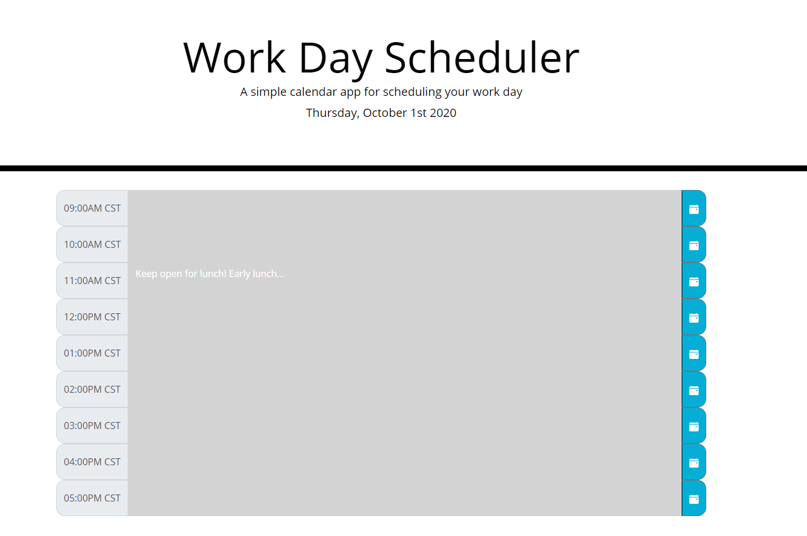
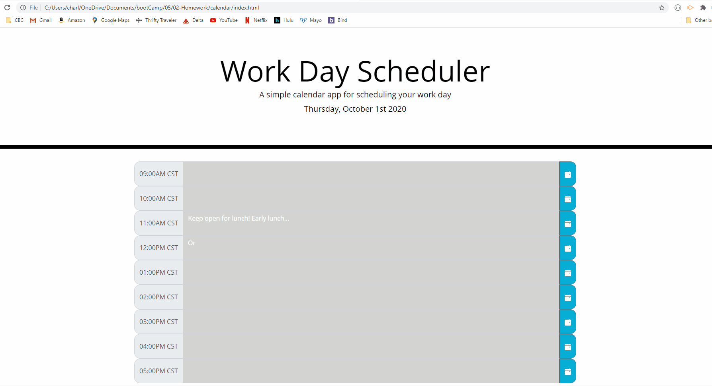

# Work Day Calendar
This application allows employees to view their schedule and update them digitally. The user will also be able to add future events. This calendar will only apply for a simple working time period (9AM to 5PM).

**Created**: `2020 October 1`
 
Deployed at: https://charlinelach.github.io/calendar/
 
Repository: https://github.com/charlinelach/calendar

## Technologies
HTML, CSS, JavaScript

# Development

## Usage Instructions
To utilize this website/application, end users may access it via [deploy link](https://charlinelach.github.io/calendar/). From this website, the user can perform clicks to take the quiz.

 
If/when users want to add schedule items to the future (must be less than 24 hours away), they may do so by adding a new event to a past or current time periods. Past time has a gray background; current time has a red background.

## Installation Instructions
N/A

## Credits & Thank Yous
**Per usual**
 
Shout out to the wonderful instructor(s) and TAs!
 
Another thank you to fellow students and asking questions before they form in my head.

# License Information
MIT License  
Copyright (c) 2020